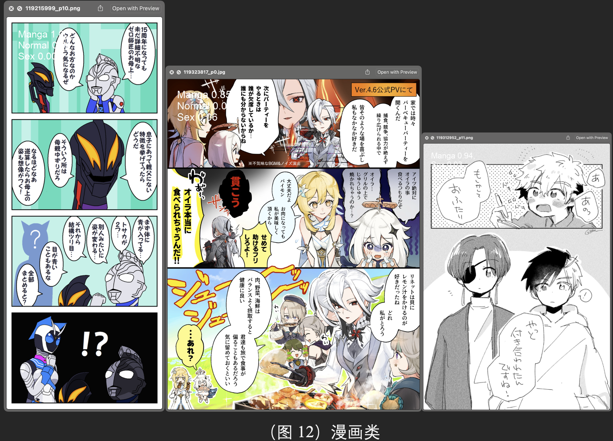

# Hello!!
## This repository's docs coming soon....

### The Fastest and most Powerful Classify Model for Pixiv Imagse

[中文文档点击这里](README_CN.md)

The pretrain model could classify 3 classes: "Manga", "Normal", "Sex".

With it you could **automatically** collate and **summarize** the images on the Pixiv website downloaded by the crawler.

Almost *NO* **hardware** requirements!

And *NO* **Graphic Card** require!

This repository has not uploaded the training code yet. If you want to train your model, please use [ultralytics](https://github.com/ultralytics/ultralytics) framework for training, the later time of this project to upload the complete process of training code (workload is bigger 😭)

## Install

### If you just want to use it without training it yourself

**Initial the environment**

```shell
conda create -n pixiv_ai python=3.10
conda activate pixiv_ai
python -m pip install -r requirements/requirement_infer.txt
```

**Then** in `autoClassify_OpenVINO.py`, find the `input_folder` and `output_folder` variables, and fill in the image folder input and output paths on your computer!

After initializing the environment and configuring the paths to the images you want to process, you're ready to **start your application**!

```shell
python autoClassify_OpenVINO.py
```

Finally, you could review the result!


here are some **Classify** examples:





Images' **Grad-Cam** from model.

You could generate your own image Hotmap with the file `other/yolo_cam/generate_model_heatmap.py`


