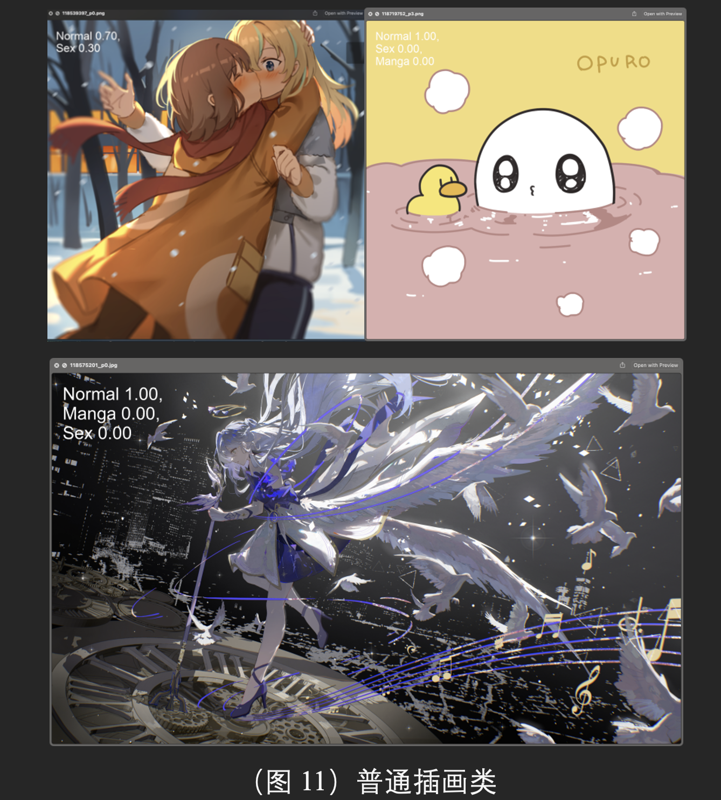
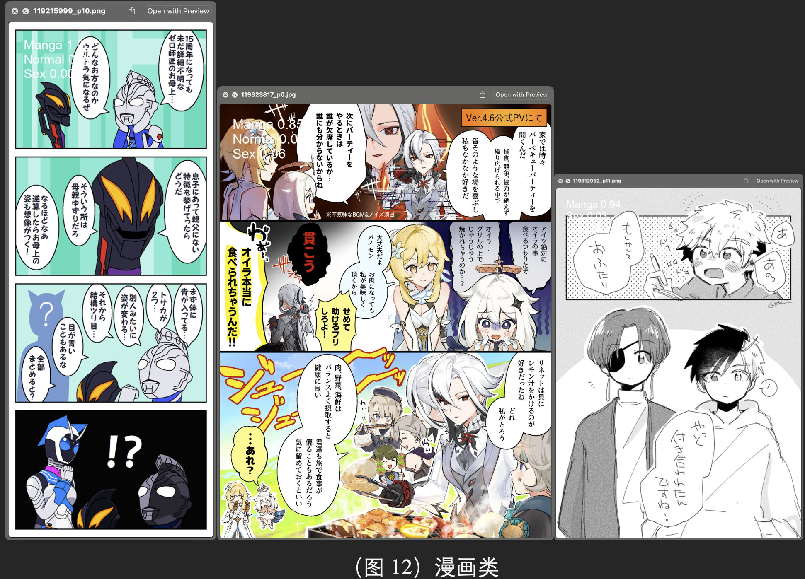
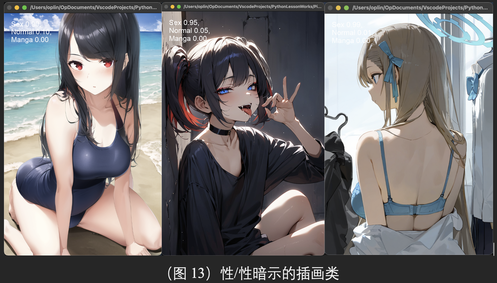
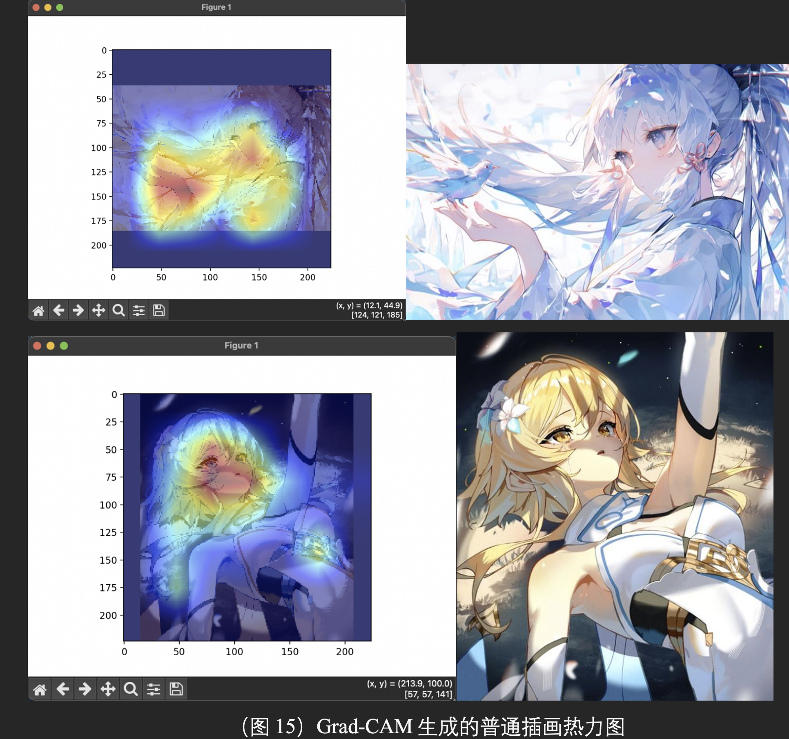
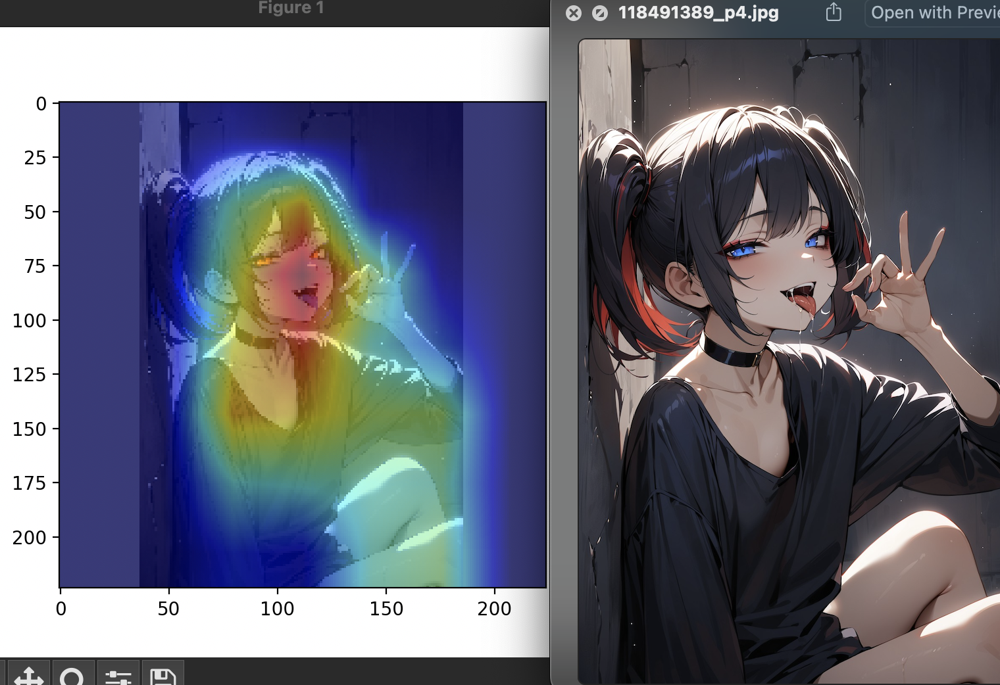

# 你好! !

### Pixiv插画网, 最快、最强大的图片分类模型！

目前项目提供的预训练模型可以对三类图片进行分类，分别是:“漫画”，“正常”，“性别”。

使用这个项目，你可以**自动**整理和**总结**爬虫下载的Pixiv网站上的图像。

几乎*没有* **硬件需求**!

并且*不需要* **显卡**!

本项目暂时没有上传训练代码, 如果您现在就想要训练自己的模型,请使用 [ultralytics](https://github.com/ultralytics/ultralytics) 框架进行训练,晚些时间此项目才会上传全套流程的训练代码(工作量比较大😭)

## 安装

### 如果你只是想使用它而不是自己训练它

**初始化环境**

```shell
conda create -n pixiv_ai python=3.10
conda activate pixiv_ai
python -m pip install -r requirements/requirement_infer.txt
```

**然后**在`autoClassify_OpenVINO.py`中，找到`input_folder`和`output_folder`变量，给这些变量填入您计算机上图像文件夹的实际输入和输出路径!

在初始化环境并配置好要处理的图像的路径之后，就可以**启动应用程序**了!

```shell
python autoClassify_OpenVINO.py
```

最后，你可以检查图像分类结果了!


下面是一些图像**分类**的例子:








根据模型输出梯度得到的热力图

你可以使用`other/yolo_cam/generate_model_heatmap.py`生成自己的图像热图。






